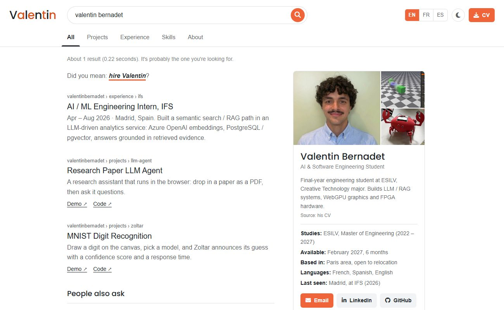

# Valentin Bernadet – portfolio

**Live site: https://bernadetvalentin-design.github.io/portofolio/**

My portfolio, built as a search engine that only knows one person. Each tab is a section (projects, experience, skills, about), and each project opens a page with the details.

Final-year engineering student at ESILV (Creative Technology), looking for a 6-month end-of-studies internship from February 2027 in AI / R&D, software engineering or technical consulting.

## Projects

| Project | What it is | Links |
|---|---|---|
| Research Paper LLM Agent | Compares scientific papers with an LLM and a RAG pipeline, fully in the browser (WebLLM, Llama-3.2-1B) | [demo](https://bernadetvalentin-design.github.io/LLM_ResearchPaper_Analysis/) · [code](https://github.com/BernadetValentin-design/LLM_ResearchPaper_Analysis) |
| MNIST Digit Recognition | MLP and CNN trained with TinyGrad (99.0% test accuracy), inference on WebGPU | [demo](https://bernadetvalentin-design.github.io/ZoltarDigit_Valentin/) · [code](https://github.com/BernadetValentin-design/ZoltarDigit_Valentin) |
| 3D Scene Editor | Raymarching scene editor written from scratch in WebGPU / WGSL | [demo](https://bernadetvalentin-design.github.io/WebGPU_Project_Interative_Scene/) · [code](https://github.com/BernadetValentin-design/WebGPU_Project_Interative_Scene) |
| E-textile capacitive matrix | 12 × 12 capacitive sensing fabric read by an FPGA (ongoing) | |
| The Extra Pocket | Recycled-leather belt pocket, from design to a Kickstarter launch | |
| Line-following robot | Delivers medication along a line, with a fold-out gripper | |

## About the site

- Plain HTML, CSS and JavaScript, no framework and no build step.
- English, French and Spanish: all texts are in `content.js`. `?lang=fr` or `?lang=es` opens the site in that language.
- Light and dark themes.
- The small 3D scene (`blobs.js`) is a WebGPU raymarcher: spheres joined with a smooth union, following the mouse. Browsers without WebGPU show a screenshot instead.
- The MNIST project page embeds the live demo.

## Contact

[valentin.bernadet@edu.devinci.fr](mailto:valentin.bernadet@edu.devinci.fr) · [LinkedIn](https://www.linkedin.com/in/valentin-bernadet) · [GitHub](https://github.com/BernadetValentin-design)
